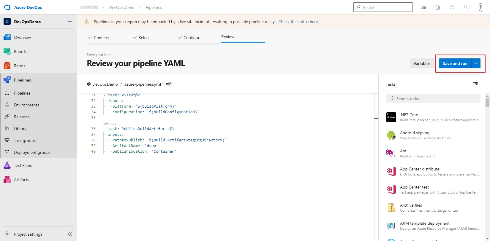

# Azure DevOps Auto Deploy

## 環境

1. .net 5 MVC
2. Azure DevOps
3. Azure App Server 免費方案

# 設定 DevOps Pipelines

- Pipelines -> Pipelines -> Create Pipelines
  
- 選擇放 Code 的地方，這邊是示範 Code 放在 Azure DevOps 裡，所以選擇 Azure Repos Git
  

- 選擇專案
  

- 選擇專案架構，這邊事先準備好的專案是.net 5 的，所以選擇 ASP.NET Core(.Net Framework)
  

  

- 產出預設的 YAML 後，要多新增一個步驟 -> Publish build artifact
  

  

- 執行產生好的 YAML
  

  

- 等個一段時間，讓 Pipeline 跑完
  

  

## 設定 Releases

- Pipeline -> Releases -> New pipeline
  

- 選擇服務的 Template
  

- 選剛剛架好的 Pipeline
  

- 選擇資源群組(這邊先示範同一個帳號內的)
  
  

- 建立 Release
  
  

- Release 建立中
  ![DoingRelease](./AzureDevOpsAutoDeployImage/DoingRelease.jpg

- 建立成功
  
  

- Hello World !
  
